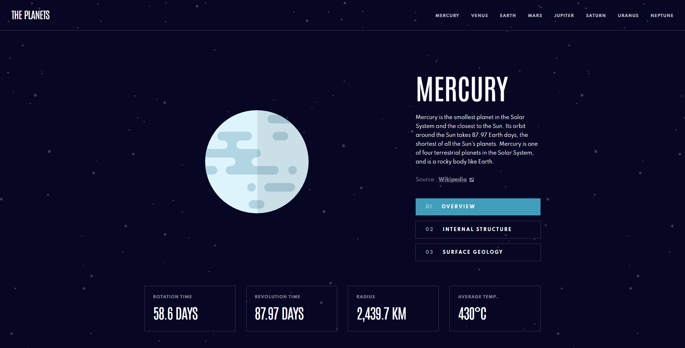

# Planets fact site

This is a solution to the [Planets fact site challenge on Frontend Mentor](https://www.frontendmentor.io/challenges/planets-fact-site-gazqN8w_f).

## Table of contents

  - [The challenge](#the-challenge)
  - [Screenshot](#screenshot)
  - [Links](#links)
  - [Built with](#built-with)
  - [Author](#author)

### The challenge

Users should be able to:

- View the optimal layout for the app depending on their device's screen size
- See hover states for all interactive elements on the page
- View each planet page and toggle between "Overview", "Internal Structure", and "Surface Geology"

### Screenshot

### Links

- [Live Site](https://hromus-51.github.io/Planets fact site/)

### Built with

- [TS](https://www.typescriptlang.org/)
- [Styled Components](https://styled-components.com/)
- [React](https://reactjs.org/) 
- [Framer Motion](https://www.framer.com/motion/)

## Author

- Telegram - [Ilgiz Farrakhov](https://t.me/Gizmo51)